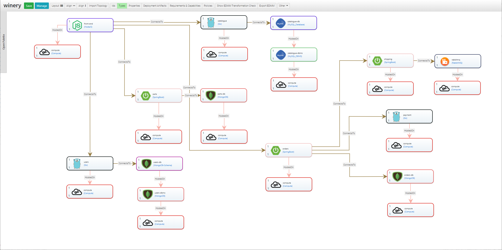
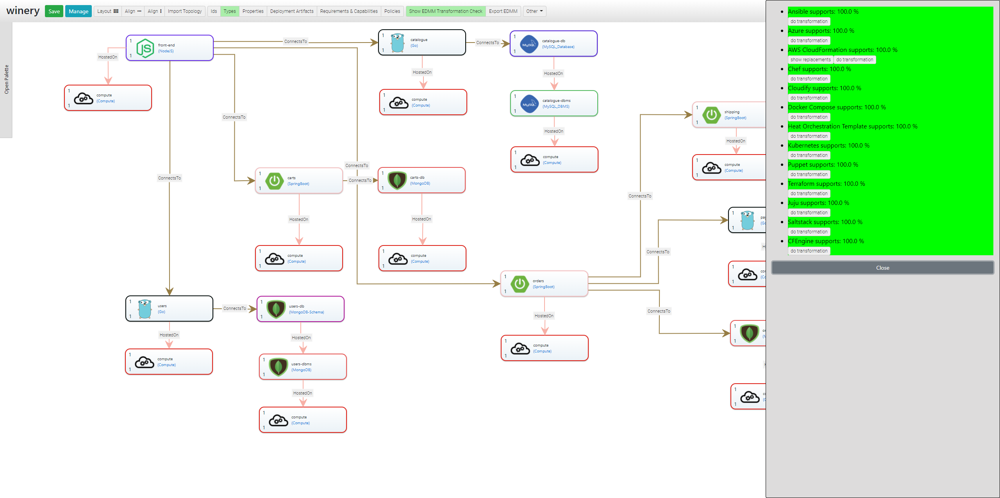

# Getting started with EDMM

[](https://opensource.org/licenses/Apache-2.0)

[**Usage**](#usage) &nbsp;|&nbsp; [**Quickstart**](#quickstart) &nbsp;|&nbsp; [**Get In Touch**](#get-in-touch) &nbsp;|&nbsp; [**Learn More**](#learn-more)

The EDMM Modeling, Decision Support, and Transformation System consists of three components:
(1) the [EDMM Modeling Tool](https://github.com/eclipse/winery),
(2) the [EDMM Transformation Framework](https://github.com/UST-EDMM/transformation-framework), and
(3) the [EDMM CLI](https://github.com/UST-EDMM/transformation-framework/releases).

---

## Usage

### Install and use the EDMM CLI

* Download the latest `edmm.zip` distribution package from the [releases](https://github.com/UST-EDMM/transformation-framework/releases) page
* Extract the files to a location on your filesystem and add it to your path variable (Linux: `$PATH`, Windows: `%PATH%`).
* Run the CLI: `edmm -r <modeling-repository> transform <target> <input>`

EDMM supports YAML files as input, according to the published [YAML specification](https://github.com/UST-EDMM/spec-yaml).
Specified components and their respective component types must be supplied in a single file.
An [example](examples/sockshop/deployment.yml) shows the usage of the built-in types to model an application deployment based on virtual compute resources, e.g., virtual machines having some software components installed.

The generated deployment technology-specific models and artifacts will be stored relative to the YAML input file.

### Run the EDMM Modeling Tool 

Prerequisites:

* Git
* Docker and Docker Compose

Clone the repository:
```shell
git clone https://github.com/UST-EDMM/getting-started.git
git submodule update --init
```

Start the environment:
```shell
docker-compose up -d
```

Afterward, EDMM Modeling Tool is running on <http://localhost:8080> and is preconfigured to support the types from the EDMM [modeling-repository](./modeling-repository).

> If you want to deploy the application on a server, change the `PUBLIC_HOSTNAME` in the [.env](.env) file to your
domain name or respective IP address before starting it with Docker Compose.

To terminate the system, run the following command:

```shell
docker-compose down
``` 

### Getting Started with the EDMM Modeling Tool

After opening the EDMM Modeling Tool on <http://localhost:8080>, it displays a set of example applications, e.g., `PetClinc` and `SockShop`.
You can see the graphical model of an application by clicking one of them.


Afterwards, navigate to the `Topology Tempalte` tab and click the `Open Editor` button.


A new browser window opens that presents the respective application structure.



Now you can enable the transformation check, to see which technology supports the currently modeled application.
Click `Show EDMM Transformation Check`.



In the sidebar, hover over the different technologies to highlight the components that are not supported.
If the **transformation check** is successful, you can trigger the transformation by clicking `do transformation`.

Alternatively, you can click `show replacements` to highlight how the structure need to be adapted to be supported by a certain deployment technology.

---

## Quickstart

Follow one of our [examples](./examples).

---

## Get In Touch

Are you interested in our research, do you have any questions or would you like further information?
Just get in touch with us below:

* Michael Wurster ([@miwurster](https://github.com/miwurster), [write a mail](mailto:wurster@iaas.uni-stuttgart.de?subject=[GitHub]%20TOSCA%20Lightning))

---

## Learn More

* Michael Wurster, Uwe Breitenbücher, Michael Falkenthal, Christoph Krieger, Frank Leymann & Karoline Saatkamp:
  [**The Essential Deployment Metamodel: A Systematic Review of Deployment Automation Technologies**](https://link.springer.com/article/10.1007%2Fs00450-019-00412-x).
  In: SICS Software-Intensive Cyber-Physical Systems, 2019
* Michael Wurster, Uwe Breitenbücher, Antonio Brogi, Ghareeb Falazi, Lukas Harzenetter, Frank Leymann, Jacopo Soldani and Vladimir Yussupov:
  [**The EDMM Modeling and Transformation System**](https://www.iaas.uni-stuttgart.de/publications/INPROC-2019-41-ICSOC-2019-The-EDMM-Modeling-and-Transformation-System.pdf).
  In: Service-Oriented Computing - ICSOC 2019 Workshops, 2019
* Michael Wurster, Uwe Breitenbücher, Lukas Harzenetter, Frank Leymann, Jacopo Soldani and Vladimir Yussupov:
  [**TOSCA Light: Bridging the Gap Between TOSCA Specification and Production-Ready Deployment Technologies**](https://www.iaas.uni-stuttgart.de/publications/Wurster_TOSCA_Light.pdf).
  In: Proceedings of the 10th International Conference on Cloud Computing and Services Science (CLOSER), 2020
