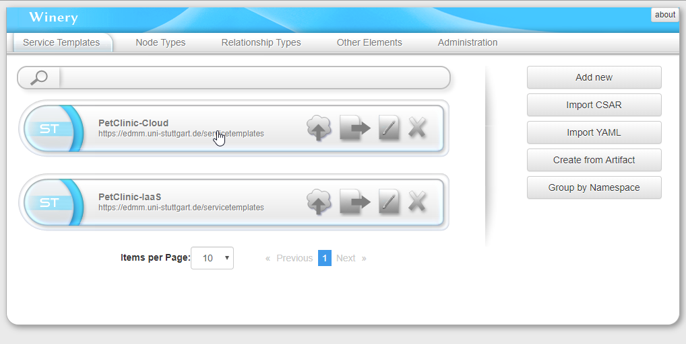
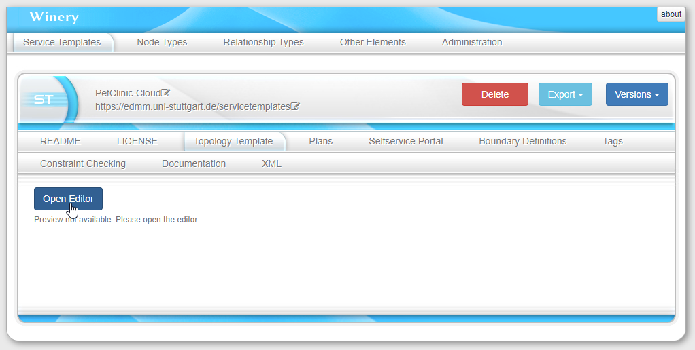
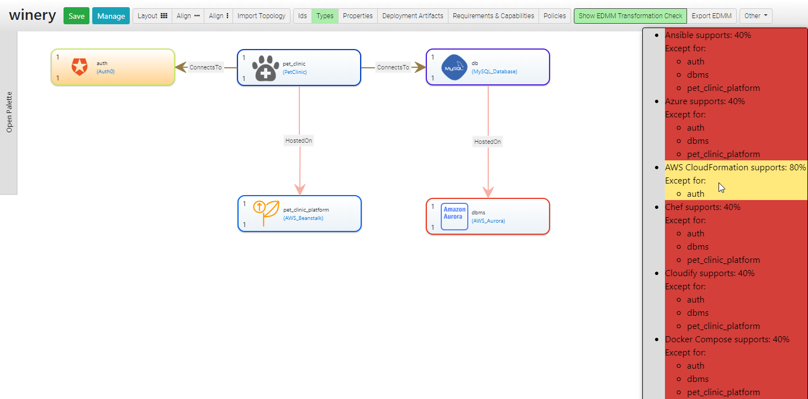

# Getting started with EDMM

[](https://opensource.org/licenses/Apache-2.0)

## Run the Modeling Tool including Transformation Checks 

### Prerequisites

* Git
* Docker

### Setup

First, clone the repository:

```shell script
git clone https://github.com/UST-EDMM/getting-started.git
```

### Running the Modeling Tool

We use [Winery](https://github.com/eclipse/winery) to create EDMM-based models graphically.
You can start the modeling tool and the transformation framework as a docker service:

```shell
docker-compose up -d
```

Afterwards, Winery is running on <http://localhost:8080> and is preconfigured to support EDMM modeling.

If you want to deploy the application on a server, change the `PUBLIC_HOSTNAME` in the [.env](.env) file to your
domain name or respective IP address before starting docker-compose.

To terminate the applications, run:

```shell
docker-compose down
``` 

### Getting Started with Winery

After opening Winery on <http://localhost:8080>, it displays two already contained example applications, `PetClinc-Cloud` and `PetClinic-IaaS`.
You can see the graphical model of an application by clicking one of them.



Afterwards, navigate to the `Topology Tempalte` tab and click the `Open Editor` button.



Now you can enable the transformation check, to see which technology supports the currently modeled application.
Click `Show EDMM Transformation Check`.


In the sidebar, hover over the different technologies to highlight the components are not supported.



If the transformation check is enabled and you add a new component from the Palette or create a new relation,
the application is resent to the transformation framework and the transformation check is updated. 

## Transforming EDMM Models

### Prerequisites

* Git
* Maven
* minikube

### Setup

Clone the repository:

```shell script
git clone https://github.com/UST-EDMM/getting-started.git
git submodule update --init
```

Build the sample application:

```shell script
mvn -f ./spring-petclinic/pom.xml clean package -DskipTests
```

Setup the [EDMM Transformation Framework](https://github.com/UST-EDMM/transformation-framework#usage)

### Transform to Kubernetes 

> Kubernetes runs in `minikube` on HyperV.

* Execute the following statement to start the transformation to Kubernetes:
  
  ```shell script
  edmm transform kubernetes ./icsoc-demo/deployment.yaml
  ```

* Start a PowerShell with administrative rights and start a Kubernetes cluster:

  ```shell script
  minikube start --cpus 2 --memory 4096 --vm-driver=hyperv
  ```

* Configure PowerShell to use minikube's Docker environment

  ```shell script
  minikube docker-env | Invoke-Expression
  ```

* Build Docker images:

  ```shell script
  docker build -t db ./icsoc-demo/kubernetes/db
  docker build -t pet-clinic ./icsoc-demo/kubernetes/pet_clinic
  ```

* Apply Kubernetes configuration:

  ```shell script
  kubectl apply -f ./icsoc-demo/kubernetes/db/db-deployment.yaml -f ./icsoc-demo/kubernetes/db/db-service.yaml
  kubectl apply -f ./icsoc-demo/kubernetes/pet_clinic/pet-clinic-deployment.yaml -f ./icsoc-demo/kubernetes/pet_clinic/pet-clinic-service.yaml
  ```

* Launch sample application:

  ```shell script
  minikube service pet-clinic-service
  # or monitor
  minikube dashboard
  ```

* Shutdown application:

  ```shell script
  minikube stop
  minikube delete
  ```


### Transform to Docker Compose

* Execute the following statement to start the transformation to Kubernetes:
  
  ```shell script
  edmm transform compose ./icsoc-demo/deployment.yaml
  ```

* Build Docker images:

  ```shell script
  docker-compose -f .\icsoc-demo\compose\docker-compose.yml build
  ```

* Start Docker Compose configuration:

  ```shell script
  docker-compose -f .\icsoc-demo\compose\docker-compose.yml up
  # restart sample application
  docker-compose -f .\icsoc-demo\compose\docker-compose.yml restart pet-clinic
  ```

* Launch sample application:
  Open a browser window and navigate to `http://{docker-hostname}:8080/petclinic`

* Shutdown application:

  ```shell script
  docker-compose -f .\icsoc-demo\compose\docker-compose.yml down
  ```
