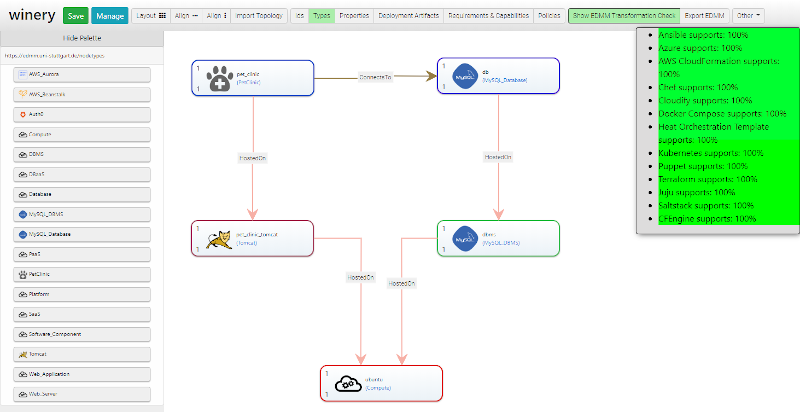

# Getting started with EDMM

[](https://opensource.org/licenses/Apache-2.0)

The EDMM Modeling, Decision Support, and Transformation System consists of three components:
(1) the [EDMM Modeling Tool](https://github.com/eclipse/winery),
(2) the [EDMM Transformation Framework](https://github.com/UST-EDMM/transformation-framework), and
(3) the [EDMM CLI](https://github.com/UST-EDMM/transformation-framework/releases).


## Usage

### Install and use the EDMM CLI

* Download the latest `edmm.zip` distribution package from the [releases](https://github.com/UST-EDMM/transformation-framework/releases) page
* Extract the files to a location on your filesystem and add it to your path variable (Linux: `$PATH`, Windows: `%PATH%`).
* Run the CLI: `edmm transform <target> <input>`

The EDMM Transformation Framework supports YAML files as input, according to the published [YAML specification](https://github.com/UST-EDMM/spec-yaml).
Specified components and their respective component types must be supplied in a single file.
An [example](edmm-core/src/test/resources/templates/scenario_iaas.yml) shows the usage of the built-in types to model an application deployment based on virtual compute resources, e.g., virtual machines having some software components installed.

The generated deployment technology-specific models and artifacts will be stored relative to the YAML input file.


### Run the EDMM Modeling Tool 

Prerequisites:

* Git
* Docker and Docker Compose

Clone the repository:

```shell script
git clone https://github.com/UST-EDMM/getting-started.git
```

Start the environment:

```shell
docker-compose up -d
```

Afterward, EDMM Modeling Tool is running on <http://localhost:8080> and is preconfigured to support EDMM-based modeling.

> If you want to deploy the application on a server, change the `PUBLIC_HOSTNAME` in the [.env](_.env) file to your
domain name or respective IP address before starting it with Docker Compose.

To terminate the system, run the following command:

```shell
docker-compose down
``` 


### Getting Started with the EDMM Modeling Tool

After opening the EDMM Modeling Tool on <http://localhost:8080>, it displays two example applications, `PetClinc-Cloud` and `PetClinic-IaaS`.
You can see the graphical model of an application by clicking one of them.


Afterwards, navigate to the `Topology Tempalte` tab and click the `Open Editor` button.


Now you can enable the transformation check, to see which technology supports the currently modeled application.
Click `Show EDMM Transformation Check`.



In the sidebar, hover over the different technologies to highlight the components that are not supported.


If the transformation check is enabled and you add a new component from the Palette or create a new relation,
the application is resent to the transformation framework and the transformation check is updated. 


### Transforming EDMM Models

Prerequisites:

* Git
* Maven
* minikube

Clone the repository:

```shell script
git clone https://github.com/UST-EDMM/getting-started.git
git submodule update --init
```

Build the sample application:

```shell script
mvn -f ./spring-petclinic/pom.xml clean package -DskipTests
```

#### Transform to Kubernetes 

> Kubernetes runs in `minikube` on HyperV.

* Execute the following statement to start the transformation to Kubernetes:
  
  ```shell script
  edmm transform kubernetes ./2019-icsoc/deployment.yaml
  ```

* Start a PowerShell with administrative rights and start a Kubernetes cluster:

  ```shell script
  minikube start --cpus 2 --memory 4096 --vm-driver=hyperv
  ```

* Configure PowerShell to use minikube's Docker environment

  ```shell script
  minikube docker-env | Invoke-Expression
  ```

* Build Docker images:

  ```shell script
  docker build -t db ./2019-icsoc/kubernetes/db
  docker build -t pet-clinic ./2019-icsoc/kubernetes/pet_clinic
  ```

* Apply Kubernetes configuration:

  ```shell script
  kubectl apply -f ./2019-icsoc/kubernetes/db/db-deployment.yaml -f ./2019-icsoc/kubernetes/db/db-service.yaml
  kubectl apply -f ./2019-icsoc/kubernetes/pet_clinic/pet-clinic-deployment.yaml -f ./2019-icsoc/kubernetes/pet_clinic/pet-clinic-service.yaml
  ```

* Launch sample application:

  ```shell script
  minikube service pet-clinic-service
  # or monitor
  minikube dashboard
  ```

* Shutdown application:

  ```shell script
  minikube stop
  minikube delete
  ```

#### Transform to Docker Compose

* Execute the following statement to start the transformation to Kubernetes:
  
  ```shell script
  edmm transform compose ./2019-icsoc/deployment.yaml
  ```

* Build Docker images:

  ```shell script
  docker-compose -f .\2019-icsoc\compose\docker-compose.yml build
  ```

* Start Docker Compose configuration:

  ```shell script
  docker-compose -f .\2019-icsoc\compose\docker-compose.yml up
  # restart sample application
  docker-compose -f .\2019-icsoc\compose\docker-compose.yml restart pet-clinic
  ```

* Launch sample application:
  Open a browser window and navigate to `http://{docker-hostname}:8080/petclinic`

* Shutdown application:

  ```shell script
  docker-compose -f .\2019-icsoc\compose\docker-compose.yml down
  ```

---

## Supported Scenario

### ESOCC 2020 Prototype

In this demonstration, we show the modeling, decision support, and transformation based on Terraform.
The motivation scenario is depicted in the screenshot below. 
The corresponding EDMM model in YAML can be found [here](2020-esocc/deployment.yml).


### ICSOC 2019 Demonstration

In this demonstration, all listed plugins focus on application deployments that are based on virtual computing resources and the software that needs to be deployed on them including their configuration and orchestration.
The following figure shows the application stacks that is used in our test cases.
The following [example](2019-icsoc/deployment.yaml) shows the resulting EDMM model.


