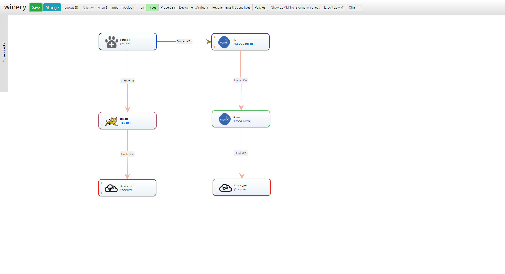
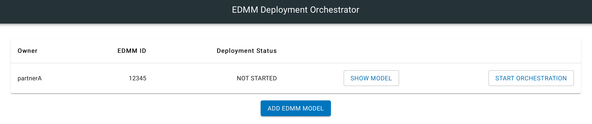
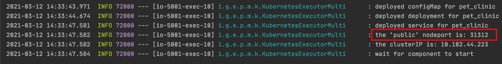
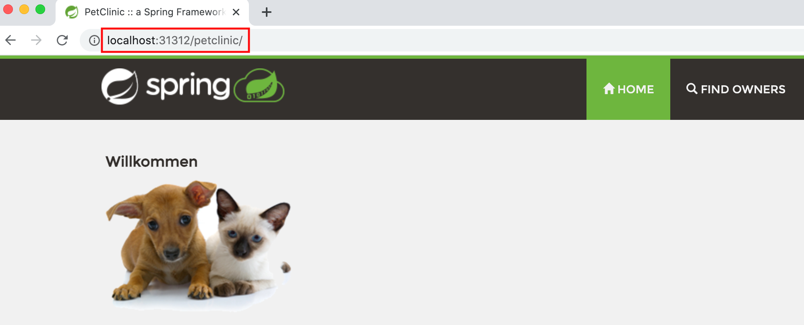

# Multi Participant and Technology Deployment

The prototype enables a decentralized deployment with (i) multiple participants and (ii) different deployment technologies using workflow technologies. Based on the EDMM model, a participant-specific BPMN workflow is generated and then fed to the Framework for the automated deployment execution. So far, Terraform, Ansible, and Kubernetes are supported.

The following example is deployed using the upcoming steps:

In this example, two participants participate in the deployment using three deployment technologies. 

---

## Setup

For the example scenario, two EDMM Frameworks and two GUIs have to be set up.

### Set repository for both participants
Each participant is running an EDMM Framework with their corresponding repository and deployment files.  

1. Set `repository.path` in `application.properties` in [edmm-web](https://github.com/UST-EDMM/edmm/tree/master/edmm-web). Make sure to have all relevant resources for the deployment, e.g.  shell scripts, war files, etc. available under this directory.
2. Set `server.port` for each participant. Participant A is set `5000` and Participant B is set `5001`.

### Start EDMM Web
1. With the chosen IDE, both EDMM Frameworks can be started. In IntelliJ and Eclipse, this can be done using the `Run` button. Now, two applications should be running. One available on port `5000` and the other on `5001`.

### Start the GUI
1. Go to [edmm-orchestration-ui](https://github.com/UST-EDMM/edmm/tree/master/edmm-orchestration-ui) and build the Dockerfile with: 
`docker build -t gui .`
2. Run the GUI for participant A:   
`docker run -it -p 3000:80 gui`
3. Run the GUI for participant B:   
`docker run -it -p 3001:80 gui` 

Now, two GUIs should be running. One can be accessed by `http://localhost:3000` and the other by `http://localhost:3001`

---

## Example Scenario

The following environments are set up:

- Participant A is resonsible for EDMM Web running on `http://localhost:5000` and the GUI on `http://localhost:3000`.
- Participant B is resonsible for EDMM Web running on `http://localhost:5001` and the GUI on `http://localhost:3001`.

### Upload EDMM to GUI
1. For participant A: Using the GUI, click on `ADD EDMM MODEL` and upload the provided `participantA.yaml` file. 

2. For participant B: Using the GUI, click on `ADD EDMM MODEL` and upload the provided `participantB.yaml` file.

Note: Multiple, DTSMs and a BPMN workflow for the respective participant should be created and can be found in the repository directory.

### Start Deployment
Either participant A or participant B can start the deployment by clicking `START ORCHESTRATION`. 

After the deployment is finished, a `FINISHED` status is updated on the GUI. Using the nodeport output of Kubernets, shown in the EDMM Framework, we can now access the petclinic application through `http://localhost:<nodeport>/petclinic`.

Note: The deployment steps and output can be followed using the EDMM Framework. 