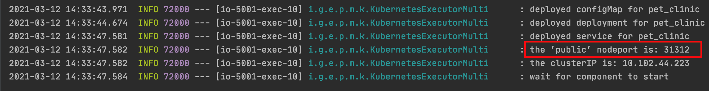

# Multi-Participant Deployment using EDMM

The prototype enables a decentralized deployment with (i) multiple participants and (ii) different deployment technologies using workflow technologies.
Based on the EDMM model, a participant-specific BPMN workflow is generated and then fed to the EDMM Framework for the automated deployment execution.
So far, Terraform, Ansible, and Kubernetes are supported.

The following PetClinic example is deployed using the steps below:


In this example, two participants participate in the deployment using three deployment technologies. 

---

## Setup

For the example scenario, two EDMM Frameworks and two Orchestration UIs have to be set up; one per each participant.

### Modify configuration for both participants

Each participant is running an EDMM Framework with their corresponding repository and deployment files.  

1. Set `repository.path` in `application.properties` in [edmm-web](https://github.com/UST-EDMM/edmm/tree/master/edmm-web).
   Make sure to have all relevant resources for the deployment, e.g., shell scripts, war files, available inside this directory.
2. Set `server.port` for each participant.
   For example, participant A sets it to `5000` and participant B sets it to `5001`.

### Start the EDMM backend (edmm-web) for each participant

Using an IDE, both EDMM Frameworks can be started.
In IntelliJ and Eclipse, this can be done using an appropriate `Run` configuration.
Examples for IntelliJ are prepared and ready to use once you opened the EDMM Framework project.

**Result**: Two applications should be running.
One available on port `5000` and the other on `5001`.

### Start the Orchestration UI for each participant

1. Go to [edmm-orchestration-ui](https://github.com/UST-EDMM/edmm/tree/master/edmm-orchestration-ui) and build the Dockerfile with: 
   ```
   docker build -t edmm-orchestration-ui .
   ```
2. Run the GUI for participant A and B:   
   ```
   docker run -it -p 3000:80 edmm-orchestration-ui
   docker run -it -p 3001:80 edmm-orchestration-ui
   ``` 

Now, each participant can access the UI: one at `http://localhost:3000` and the other at `http://localhost:3001`.

---

## Example Scenario

The following environments are set up:

- Participant A is responsible for the EDMM backend running on `http://localhost:5000` and the Orchestration UI on `http://localhost:3000`.
- Participant B is responsible for the EDMM backend running on `http://localhost:5001` and the Orchestration UI on `http://localhost:3001`.

### Upload EDMM model to Orchestration UI

1. For participant A: 
   Using the UI, click on `ADD EDMM MODEL` and upload the provided `participantA.yaml` file. 

2. For participant B:
   Using the UI, click on `ADD EDMM MODEL` and upload the provided `participantB.yaml` file.


Note: Multiple, DTSMs and a BPMN workflow for the respective participant should be created and can be found in the repository directory.

### Start the deployment utilizing the generated BPMN workflows

Participant A or participant B can start the deployment by clicking `START ORCHESTRATION` (the order does not matter!).

After the deployment, a `FINISHED` status is shown in the respective Orchestration UI.

Using the `nodeport` output of Kubernetes plugin shown in the EDMM Framework, we can now access the PetClinic application through `http://localhost:<nodeport>/petclinic`.




> **Note**: The deployment steps and output can be followed using the EDMM Framework log. 
