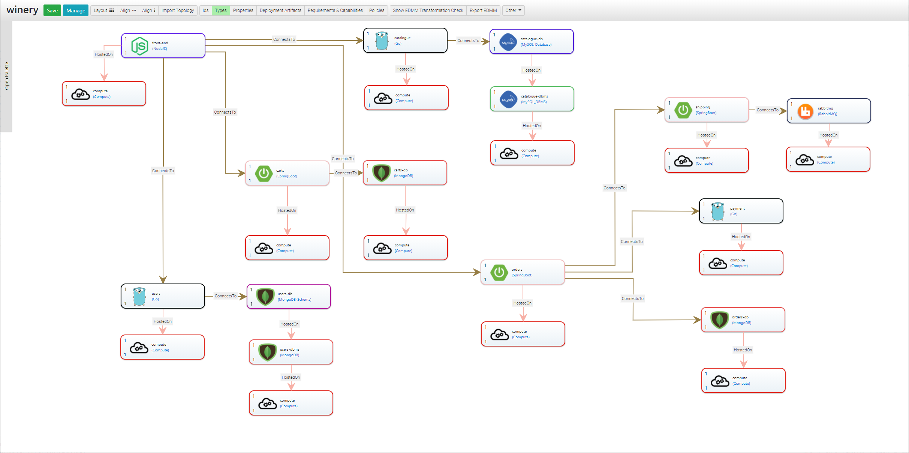

# Sock Shop - A Microservices Demo Application

> Sock Shop simulates the user-facing part of an e-commerce website that sells socks.
> It demonstrates how to implement and deploy multiple services using different programming languages ([more information](https://microservices-demo.github.io)).

Next figure shows the overall application structure modeled using EDMM.
The topology can be transformed into the files and templates required by a certain deployment automation technology, which is described below in detail for a couple of technologies.



---

## Kubernetes

### Transform EDMM model

#### Using the EDMM CLI

```shell
edmm transform -r ../../modeling-repository kubernetes ./deployment.yml
```

#### Using the EDMM Modeling Tool

Open the topology template of the `SockShop` application.

In the new browser window, click on `EDMM Transformation Check` and click on `do transformation` of the **Kubernetes** entry.


Extract the downloaded package to `./kubernetes`:
```shell
unzip kubernetes.zip -d ./kubernetes
```

### Start a Kubernetes Cluster on Windows

Start a PowerShell with administrative rights and start a Kubernetes cluster:
```shell
minikube start --cpus 2 --memory 4096 --vm-driver=hyperv
```

Configure PowerShell to use minikube's Docker environment:
```shell
minikube docker-env | Invoke-Expression
```

### Build Docker Containers

```shell
# cart service
docker build -t carts-db ./kubernetes/carts-db
docker build -t carts ./kubernetes/carts
# catalogue service
docker build -t catalogue-db ./kubernetes/catalogue-db
docker build -t catalogue ./kubernetes/catalogue
# payment service
docker build -t payment ./kubernetes/payment
# rabbitmq
docker build -t rabbitmq ./kubernetes/rabbitmq
# shipping service
docker build -t shipping ./kubernetes/shipping
# order service
docker build -t orders-db ./kubernetes/orders-db
docker build -t orders ./kubernetes/orders
# user service
docker build -t users-db ./kubernetes/users-db
docker build -t users ./kubernetes/users
# front-end
docker build -t front-end ./kubernetes/front-end
```

### Provisioning of the Application 

```shell
# carts service
kubectl apply -f ./kubernetes/carts-db/carts-db-config.yaml -f ./kubernetes/carts-db/carts-db-deployment.yaml -f ./kubernetes/carts-db/carts-db-service.yaml
kubectl apply -f ./kubernetes/carts/carts-config.yaml -f ./kubernetes/carts/carts-deployment.yaml -f ./kubernetes/carts/carts-service.yaml
# catalogue service
kubectl apply -f ./kubernetes/catalogue-db/catalogue-db-config.yaml -f ./kubernetes/catalogue-db/catalogue-db-deployment.yaml -f ./kubernetes/catalogue-db/catalogue-db-service.yaml
kubectl apply -f ./kubernetes/catalogue/catalogue-config.yaml -f ./kubernetes/catalogue/catalogue-deployment.yaml -f ./kubernetes/catalogue/catalogue-service.yaml
# payment service
kubectl apply -f ./kubernetes/payment/payment-config.yaml -f ./kubernetes/payment/payment-deployment.yaml -f ./kubernetes/payment/payment-service.yaml
# rabbitmq
kubectl apply -f ./kubernetes/rabbitmq/rabbitmq-config.yaml -f ./kubernetes/rabbitmq/rabbitmq-deployment.yaml -f ./kubernetes/rabbitmq/rabbitmq-service.yaml
# shipping service
kubectl apply -f ./kubernetes/shipping/shipping-config.yaml -f ./kubernetes/shipping/shipping-deployment.yaml -f ./kubernetes/shipping/shipping-service.yaml
# order service
kubectl apply -f ./kubernetes/orders-db/orders-db-config.yaml -f ./kubernetes/orders-db/orders-db-deployment.yaml -f ./kubernetes/orders-db/orders-db-service.yaml
kubectl apply -f ./kubernetes/orders/orders-config.yaml -f ./kubernetes/orders/orders-deployment.yaml -f ./kubernetes/orders/orders-service.yaml
# user service
kubectl apply -f ./kubernetes/users-db/users-db-config.yaml -f ./kubernetes/users-db/users-db-deployment.yaml -f ./kubernetes/users-db/users-db-service.yaml
kubectl apply -f ./kubernetes/users/users-config.yaml -f ./kubernetes/users/users-deployment.yaml -f ./kubernetes/users/users-service.yaml
# front-end
kubectl apply -f ./kubernetes/front-end/front-end-config.yaml -f ./kubernetes/front-end/front-end-deployment.yaml -f ./kubernetes/front-end/front-end-service.yaml
```

### Launch the Application

```shell
minikube service front-end-service
# or monitor
minikube dashboard
```

### Shutdown the Kubernetes Cluster

```shell
minikube delete
```
